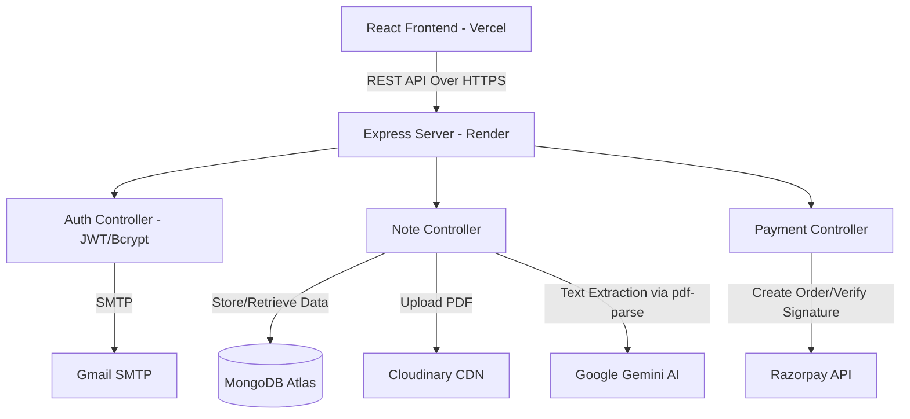
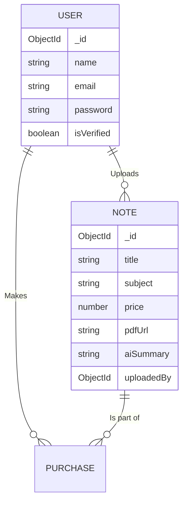

# PROJECT REPORT
### ON
# "Notes Marketplace: An AI-Powered Academic Resource Sharing Platform"

**Submitted in partial fulfillment of the requirements for the Degree**

*(Format this title page according to your college's specific guidelines)*

---
\pagebreak

## DECLARATION
I/We hereby declare that the project titled **"Notes Marketplace"** submitted for the partial fulfillment of the degree is my/our original work and the project has not formed the basis for the award of any degree, associate-ship, fellowship or any other similar titles in this or any other University or examining body.

*(Your Signature)*  
*(Your Name/Roll Number)*  

---
\pagebreak

## ACKNOWLEDGEMENT
I would like to express my profound gratitude to everyone who supported me throughout this project. I am deeply thankful to my guide/mentor for their expert guidance. I also extend my thanks to the faculty members and my peers for their valuable feedback, and my family for their endless encouragement.

---
\pagebreak

## ABSTRACT
With the rapid shift towards digital education, students frequently face challenges in finding reliable, high-quality academic materials tailored to their specific courses. The "Notes Marketplace" is an advanced web-based platform engineered to bridge this gap by facilitating the seamless sharing, purchasing, and discovering of academic notes and documents.

Built on the modern **MERN Stack** (MongoDB, Express.js, React.js, Node.js), this platform introduces a highly secure and interactive environment. Key innovations include **Google Gemini AI integration** for the automatic generation of document summaries locally, preventing students from purchasing irrelevant materials. The platform ensures bank-grade security through **JSON Web Tokens (JWT)** for session management, dynamic **Email OTP verification** via Nodemailer for user authenticity, and secure cloud storage utilizing **Cloudinary**. Financial transactions are securely managed via the **Razorpay API** gateway.

The resulting system is a highly scalable, robust electronic commerce environment tailored explicitly for the educational sector, ultimately fostering a collaborative and accessible academic community.

---
\pagebreak

## TABLE OF CONTENTS
1. [Introduction](#1-introduction)
2. [Problem Definition & Objectives](#2-problem-definition--objectives)
3. [Literature Review](#3-literature-review)
4. [System Requirements Analysis](#4-system-requirements-analysis)
5. [Technology Stack](#5-technology-stack)
6. [System Design & Architecture](#6-system-design--architecture)
7. [Implementation Details & Modules](#7-implementation-details--modules)
8. [Security & Deployment](#8-security--deployment)
9. [Testing](#9-testing)
10. [Conclusion & Future Scope](#10-conclusion--future-scope)
11. [References](#11-references)

---
\pagebreak

## 1. INTRODUCTION
### 1.1 Background
The academic ecosystem generates a vast amount of handwritten and digital notes. However, these valuable resources are often restricted to small peer groups. A centralized digital marketplace allows students across various universities and courses to monetize their hard work while providing targeted study materials to those in need.

### 1.2 Purpose
The purpose of this project is to develop a comprehensive full-stack web application that serves as a dedicated marketplace for academic notes. By leveraging artificial intelligence to summarize content and secure payment gateways to handle transactions, the platform guarantees trust and efficiency between buyers and sellers.

### 1.3 Scope
The current system allows for:
- User registration, OTP authentication, and profile management.
- Uploading PDF documents.
- Automatic AI generation of document summaries.
- Browsing, filtering (by college, subject, semester), and purchasing notes via Razorpay.
- Secure, access-controlled downloading of purchased materials.

---

## 2. PROBLEM DEFINITION & OBJECTIVES
### 2.1 Problem Statement
Existing platforms for selling digital goods are often generic and lack features specifically tailored to students (such as filtering by semester, college, or subject). Furthermore, buyers often gamble on the quality or relevance of notes because they cannot effectively preview the document content before purchasing.

### 2.2 Objectives
1. **Targeted Discovery**: Allow filtering of notes by educational parameters (Semester, Subject, College).
2. **AI-Driven Transparency**: Utilize Generative AI (Google Gemini 2.5 Flash) to analyze uploaded PDFs and automatically generate a 2-sentence summary, functioning as an intelligent preview mechanism.
3. **Secure Transactions**: Implement Razorpay to handle payments seamlessly without storing sensitive financial data on the server.
4. **Data Integrity & Storage**: Migrate from volatile local storage to robust cloud storage (Cloudinary) for persistent PDF handling.

---

## 3. LITERATURE REVIEW
Historically, students relied on local campus photocopy shops to distribute notes. Digital platforms like Google Drive lacked monetization, while platforms like Amazon Kindle Direct Publishing were too complex for casual note sharing. 

Modern educational tech platforms have shown a trend towards micro-learning and peer-to-peer sharing. However, the integration of Large Language Models (LLMs) to automatically process and summarize long-form academic PDFs represents a novel approach in the C2C (Consumer to Consumer) marketplace domain.

---

## 4. SYSTEM REQUIREMENTS ANALYSIS

### 4.1 Functional Requirements
- **FR1:** The system shall require users to verify their accounts via an OTP sent to their registered email.
- **FR2:** Users shall be able to upload PDF files up to 10MB.
- **FR3:** The backend system shall asynchronously trigger an AI service to read the uploaded PDF and generate a summary.
- **FR4:** The system shall restrict PDF downloads strictly to users who have successfully completed the Razorpay payment flow or if the note is marked as "Free".
- **FR5:** Users shall maintain a profile displaying their uploaded notes and purchased materials.

### 4.2 Non-Functional Requirements
- **Performance:** App loading time should be under 2 seconds. AI summary generation should process in the background without blocking the UI.
- **Security:** Passwords must be hashed using `bcrypt`. JWTs must be used for route protection. Files must be securely streamed to Cloudinary.
- **Scalability:** The application must utilize a stateless REST API design to allow independent horizontal scaling of the backend.

### 4.3 Software Requirements
- **Frontend Code:** HTML5, CSS3, JavaScript (ES6+), React.js v18.
- **Backend Environment:** Node.js, Express.js.
- **Database:** MongoDB Atlas (Cloud Database).
- **Tools:** Visual Studio Code, Git, GitHub, Postman.
- **Hosting:** Vercel (Frontend), Render (Backend).

---
\pagebreak

## 5. TECHNOLOGY STACK

1. **Frontend: React.js & Tailwind CSS**
   - React.js facilitates the creation of reusable UI components and efficient DOM manipulation using the Virtual DOM.
   - Tailwind CSS provides utility-first CSS for rapid, responsive styling, utilizing a glassmorphism design methodology.
   - Framer Motion handles complex, fluid UI animations.

2. **Backend: Node.js & Express.js**
   - Node.js offers a non-blocking, event-driven architecture perfect for handling concurrent API requests.
   - Express.js provides a robust routing mechanism and middleware integration capability.

3. **Database: MongoDB & Mongoose**
   - A NoSQL database provides the flexibility needed for dynamic document structures (e.g., Note schemas with varying fields).
   - Mongoose acts as an Object Data Modeling (ODM) library providing schema validation.

4. **Cloudinary (IaaS)**
   - Utilized for dynamic media management. `multer-storage-cloudinary` streams the `multipart/form-data` uploads directly to cloud buckets.

5. **Google Gemini LLM**
   - Utilizes `@google/generative-ai` SDK and `pdf-parse` to extract text and generate hyper-contextual summaries.

---

## 6. SYSTEM DESIGN & ARCHITECTURE

The application follows a standard 3-tier Client-Server Architecture.

### 6.1 Database Schema Diagram (Entity Relationship)

---

## 7. IMPLEMENTATION DETAILS & MODULES

### 7.1 Authentication Module
To combat spam and ensure high trust, a rigid Authentication pipeline is implemented.
1. User submits details.
2. Server hashes the password with `bcrypt` (Salt rounds = 10) and saves the user as `isVerified: false`.
3. Server generates a dynamic 6-digit numeric OTP and dispatches it via **Nodemailer** using an HTML template.
4. User submits the OTP. Server compares it, flags the user as verified, and signs a **JSON Web Token**.

### 7.2 AI Summarization Pipeline
This is the Unique Selling Proposition (USP) of the project.
1. When a PDF is sent to the server, `multer` immediately streams it to **Cloudinary**.
2. Cloudinary returns a secure URL. The Note is saved to MongoDB.
3. The server responds `201 Created` immediately to the user so they don't have to wait.
4. In the background, the server fetches the PDF from Cloudinary into a temporary system buffer.
5. `pdf-parse` extracts up to 2500 characters of raw text.
6. The text is fed to a custom prompt using the `gemini-2.5-flash` model, commanding it to write a 2-sentence summary of the target audience and topics.
7. MongoDB is updated asynchronously with the generated `aiSummary` string.

### 7.3 Payment Gateway (Razorpay) Integration Workflow
1. User clicks "Buy". Frontend hits the `/api/payment/create-order` backend endpoint.
2. Backend communicates with Razorpay servers with the `RAZORPAY_KEY_ID` and `SECRET` to create a new Order ID.
3. Frontend receives the Order ID and invokes the internal `window.Razorpay` checkout modal.
4. Upon successful card/UPI payment, Razorpay returns a `razorpay_payment_id` and `razorpay_signature`.
5. The frontend forwards this to the backend. The backend utilizes Node's `crypto` module to reconstruct the **HMAC SHA256 signature** to strictly verify the transaction authenticity before granting PDF access.

---

## 8. SECURITY & DEPLOYMENT

### 8.1 Security Best Practices
- **Never Trust The Client:** All price calculations and access controls occur securely on the backend.
- **Passwords:** Never stored in plaintext.
- **Environment Variables:** Confidential keys (Database URIs, AI Keys, Razorpay Secrets) are stored in `.env` files and strictly excluded from version control using `.gitignore`.
- **CORS Handling:** Restricted Cross-Origin Resource Sharing to allow traffic only from authorized frontend domains.

### 8.2 Live Deployment
The local developmental environment has been transitioned to the cloud:
- **Frontend Hosting:** Vercel (Optimizes React builds, sets up Global CDN).
- **Backend Hosting:** Render.com (Hosts the Node.js instances).
- **Storage Shift:** To survive the ephemeral file system architecture of free cloud platforms, local `fs` interactions were entirely replaced with the Cloudinary object storage service.

---

## 9. TESTING

*(Include screenshots of your live app here before printing/submitting!)*

| Test Case | Expected Outcome | Status |
| :--- | :--- | :--- |
| Enter wrong Email OTP | System rejects token, asks retry | **PASS** |
| Upload non-PDF file | Multer filter blocks upload, throws error | **PASS** |
| View Premium Note | View blocked, prompts Razorpay checkout | **PASS** |
| Run AI Background Task | Database updates with AI summary string after ~3 secs | **PASS** |

---

## 10. CONCLUSION & FUTURE SCOPE

### 10.1 Conclusion
The "Notes Marketplace" successfully addresses the inefficiencies in academic resource allocation. By strictly segregating functionalities into micro-modules, integrating State-of-the-Art AI for contextual clarity, and securing operations through standardized cryptographic techniques, the project acts as a highly robust, scalable modern web application.

### 10.2 Future Scope
1. **Dynamic Shopping Cart System:** Allowing bulk purchases of multiple subjects in one unified transaction using Razorpay's cart mechanisms.
2. **Admin Dashboard:** Implement a top-level role-based authorization to monitor total platform revenue, total users, and ban malicious uploads.
3. **Advanced AI Queries:** Chatting directly with the uploaded PDF using Vector embeddings and RAG (Retrieval-Augmented Generation).

---

## 11. REFERENCES
1. React Documentation: https://react.dev/
2. Node.js Architecture: https://nodejs.org/en/docs/
3. Google Generative AI SDK: https://ai.google.dev/docs
4. Razorpay Web Integration: https://razorpay.com/docs/payments/payment-gateway/web-integration/
5. System Design Principles: "Designing Data-Intensive Applications" by Martin Kleppmann.

---
*Created by [Your Name] for Academic Submission.*
