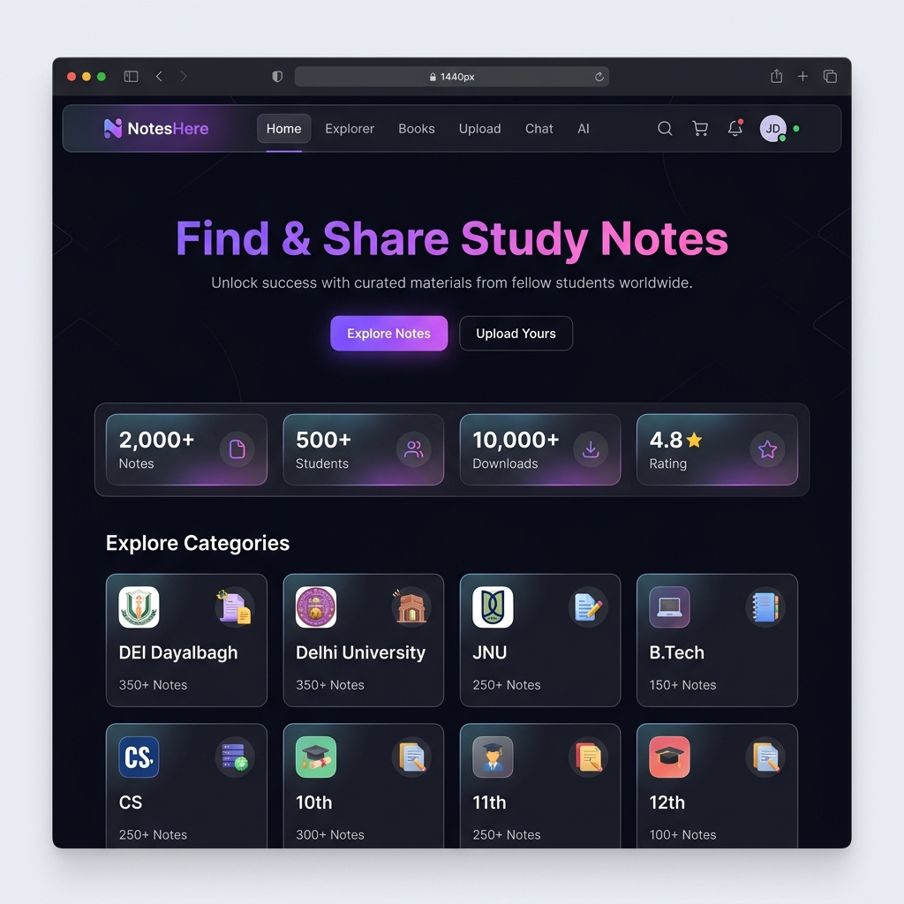
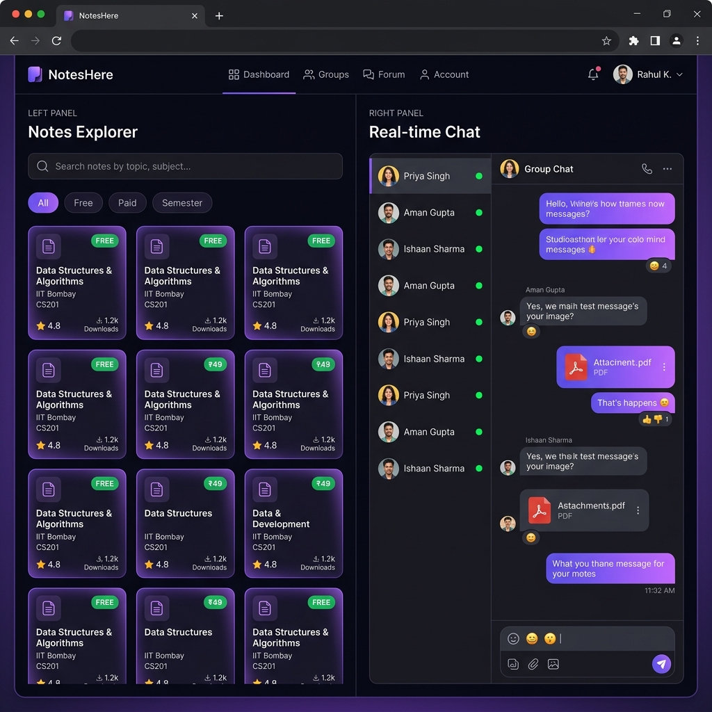
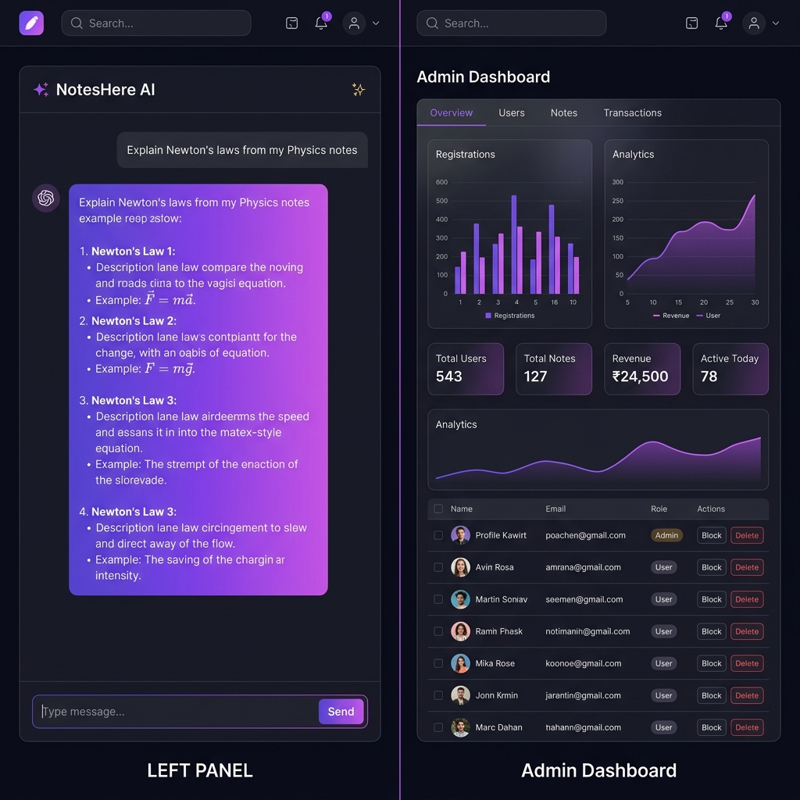

<div align="center">

# 📚 NotesHere — Student Notes Marketplace

**A full-stack platform where students buy, sell, and share academic notes with AI-powered insights.**

[](https://reactjs.org/)
[](https://nodejs.org/)
[](https://www.mongodb.com/)
[](https://socket.io/)
[](https://razorpay.com/)
[](https://cloudinary.com/)

[🌐 Live Demo](https://github.com/DEVKUMAR9012/notes-marketplace) · [🐛 Report Bug](https://github.com/DEVKUMAR9012/notes-marketplace/issues) · [✨ Request Feature](https://github.com/DEVKUMAR9012/notes-marketplace/issues)

</div>

---

## 📸 Screenshots

### 🏠 Home Page


### 🔍 Explorer & Real-time Chat


### 🤖 AI Assistant & Admin Dashboard


---

## ✨ Features

### 👨‍🎓 For Students
- 🔍 **Browse & Search Notes** — Filter by college, subject, semester, and price
- 📖 **PDF Preview** — Preview up to 3 pages before buying (paywall for paid notes)
- 🛒 **Cart & Checkout** — Add notes to cart and purchase via Razorpay
- ⭐ **Rate & Review** — Leave star ratings and comments on purchased notes
- 🔖 **Bookmarks** — Save notes for later reading
- 📚 **Books Section** — Browse textbooks and reference materials separately

### 🧑‍💼 For Sellers / Uploaders
- 📤 **Upload Notes** — Upload PDFs with metadata (subject, college, semester, price)
- 🤖 **Auto AI Summary** — Google Gemini generates an AI summary on every upload
- 💸 **Earn from Sales** — Wallet system with withdrawal support
- 📧 **Notify Followers** — Automatic email alerts to followers on new uploads
- 👥 **Follower System** — Build an audience around your notes

### 💬 Real-time Chat
- ⚡ **Socket.io Messaging** — Instant real-time 1-on-1 chat
- 😀 **Emoji Picker** — Full emoji support in conversations
- 📎 **File Sharing** — Share files and images in chat
- 🟢 **Online Presence** — See who is currently online
- 🔔 **Unread Badges** — Unread message count indicators

### 🤖 AI Assistant
- 📝 **Gemini-Powered Chat** — Ask questions about notes or any academic topic
- 📄 **PDF-Aware Answers** — AI reads your uploaded PDFs for context
- 💡 **Auto-Generated Summaries** — Every note gets an AI summary automatically

### 🛡️ Admin Dashboard
- 📊 **Analytics** — Charts for users, notes, revenue, and downloads
- 👥 **User Management** — View, block, unblock, delete users; assign roles
- 📋 **Notes Management** — Approve, reject, or delete uploaded notes
- 💰 **Transaction History** — Full audit trail of all payments
- 📨 **Email Logs** — Monitor all outgoing emails
- 🔒 **Session Tracking** — IP address, location, and browser metadata per user

### 🔐 Auth & Security
- 📧 **Email + OTP Verification** — Secure signup with OTP via email
- 🔑 **Google OAuth** — One-click sign-in with Google
- 🐙 **GitHub OAuth** — One-click sign-in with GitHub
- 🔒 **JWT Auth** — Stateless authentication with refresh support
- 👻 **Guest Mode** — Browse without signing up (limited access)
- 🛡️ **Rate Limiting** — API rate limiting to prevent abuse

---

## 🏗️ Tech Stack

| Layer | Technology |
|---|---|
| **Frontend** | React 18, React Router v6, Framer Motion, Zustand |
| **Styling** | Tailwind CSS, Custom CSS, Glassmorphism |
| **PDF Viewer** | pdfjs-dist (client-side PDF rendering) |
| **Real-time** | Socket.io (client + server) |
| **Backend** | Node.js, Express.js |
| **Database** | MongoDB (Atlas) + Mongoose ODM |
| **Auth** | JWT, Google OAuth, GitHub OAuth, OTP via Email |
| **File Storage** | Cloudinary (PDFs, avatars) |
| **Payments** | Razorpay (order + webhook verification) |
| **AI** | Google Gemini API (`@google/generative-ai`) |
| **Email** | Nodemailer + Resend |
| **Charts** | Recharts |
| **Deployment** | Railway (backend) + Netlify / Vercel (frontend) |

---

## 📁 Project Structure

```
notes-marketplace/
├── frontend/                  # React app (Create React App)
│   └── src/
│       ├── pages/             # Route-level pages
│       │   ├── Home.jsx           # Landing + category cards
│       │   ├── Explorer.jsx       # Browse & search notes
│       │   ├── Books.jsx          # Books/textbooks section
│       │   ├── NotePreviewPage.jsx # PDF viewer + sidebar
│       │   ├── Upload.jsx         # Upload a note
│       │   ├── Profile.jsx        # User profile + stats
│       │   ├── Chat.jsx           # Real-time 1-on-1 chat
│       │   ├── AI.jsx             # Gemini AI assistant
│       │   ├── AdminDashboard.jsx # Admin panel
│       │   ├── Login.jsx          # Login page
│       │   └── Register.jsx       # Register page
│       ├── components/        # Reusable UI components
│       ├── context/           # React context (Auth, Cart, Socket)
│       ├── store/             # Zustand stores
│       └── utils/             # API client, helpers
│
└── backend/                   # Node.js / Express API
    ├── controllers/           # Route handlers
    ├── models/                # Mongoose schemas
    │   ├── User.js            # Users + wallet + followers
    │   ├── Note.js            # Notes + AI summary
    │   ├── Review.js          # Star ratings
    │   ├── Message.js         # Chat messages
    │   ├── Transaction.js     # Payment records
    │   └── ...
    ├── routes/                # API route definitions
    ├── middleware/            # Auth, rate-limit, upload
    ├── utils/                 # Email templates, AI summary, helpers
    └── server.js              # Entry point + Socket.io setup
```

---

## 🚀 Getting Started

### Prerequisites
- Node.js >= 18
- MongoDB Atlas account (or local MongoDB)
- Cloudinary account (free tier works)
- Razorpay account (test mode)
- Google Gemini API key

### 1. Clone the repo
```bash
git clone https://github.com/DEVKUMAR9012/notes-marketplace.git
cd notes-marketplace
```

### 2. Setup Backend
```bash
cd backend
npm install
```

Create a `.env` file in `backend/`:
```env
PORT=5000
MONGO_URI=your_mongodb_atlas_uri
JWT_SECRET=your_super_secret_key

# Cloudinary
CLOUDINARY_CLOUD_NAME=your_cloud_name
CLOUDINARY_API_KEY=your_api_key
CLOUDINARY_API_SECRET=your_api_secret

# Razorpay
RAZORPAY_KEY_ID=rzp_test_xxxxxxxxxxxx
RAZORPAY_KEY_SECRET=your_secret

# Google OAuth
GOOGLE_CLIENT_ID=your_google_client_id

# Google Gemini AI
GEMINI_API_KEY=your_gemini_api_key

# Email (Nodemailer or Resend)
EMAIL_USER=your_email@gmail.com
EMAIL_PASS=your_app_password
```

```bash
npm run dev     # Starts with nodemon on port 5000
```

### 3. Setup Frontend
```bash
cd frontend
npm install
```

Create a `.env` file in `frontend/`:
```env
REACT_APP_API_URL=http://localhost:5000/api
REACT_APP_SOCKET_URL=http://localhost:5000
REACT_APP_RAZORPAY_KEY_ID=rzp_test_xxxxxxxxxxxx
REACT_APP_GOOGLE_CLIENT_ID=your_google_client_id
```

```bash
npm start       # Starts React dev server on port 3000
```

---

## 🔌 API Endpoints

| Method | Endpoint | Description |
|---|---|---|
| `POST` | `/api/auth/register` | Register with email + OTP |
| `POST` | `/api/auth/login` | Login, get JWT |
| `GET` | `/api/notes` | Get all approved notes (paginated) |
| `GET` | `/api/notes/:id` | Get single note |
| `POST` | `/api/notes` | Upload a new note (auth required) |
| `GET` | `/api/notes/:id/check-purchase` | Check if user bought this note |
| `POST` | `/api/notes/:id/reviews` | Add a review |
| `GET` | `/api/notes/:id/reviews` | Get all reviews |
| `POST` | `/api/payments/order` | Create Razorpay order |
| `POST` | `/api/payments/verify` | Verify payment & grant access |
| `GET` | `/api/profile/:id` | Get public profile |
| `POST` | `/api/profile/follow/toggle` | Follow / unfollow a user |
| `GET` | `/api/admin/users` | List all users (admin only) |
| `PATCH` | `/api/admin/users/:id/block` | Block / unblock user |

---

## 🗄️ Database Models

| Model | Key Fields |
|---|---|
| `User` | name, email, role, walletBalance, followers, purchasedNotes, stars |
| `Note` | title, subject, college, semester, price, pdfUrl, aiSummary, rating |
| `Review` | user, note, rating, comment |
| `Transaction` | buyer, note, amount, razorpayOrderId, status |
| `Message` | sender, receiver, content, type, readAt |
| `AIChat` | user, messages[], model |
| `Withdrawal` | user, amount, status, upiId |

---

## 👤 User Roles

| Role | Permissions |
|---|---|
| `user` | Browse, buy notes, chat, use AI |
| `seller` | Everything above + upload and sell notes |
| `admin` | Full dashboard — manage users, notes, transactions |

---

## 🤝 Contributing

Contributions are welcome! Please:

1. Fork the project
2. Create your feature branch (`git checkout -b feature/AmazingFeature`)
3. Commit your changes (`git commit -m 'feat: add AmazingFeature'`)
4. Push to the branch (`git push origin feature/AmazingFeature`)
5. Open a Pull Request

---

## 📄 License

This project is open source and available under the [MIT License](LICENSE).

---

<div align="center">

**Made with ❤️ by [Dev Kumar](https://github.com/DEVKUMAR9012)**

⭐ Star this repo if you found it helpful!

</div>
